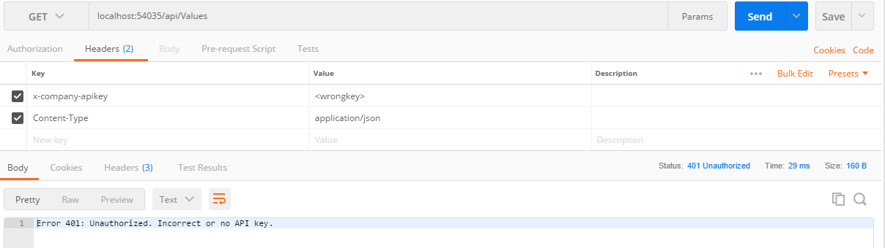

# A simple middleware to check for API Keys in your ASP.Net Core APIs

This is a simple ASP.Net middleware you can use to check for API keys in each request to you services. It is intended to be used in a microservice architecture where each (group of) service(s) is a seperate project.

Just configure the middleware in your Startup.cs:

```csharp
public void Configure(IApplicationBuilder app, IHostingEnvironment env)
    {
        if (env.IsDevelopment())
        {
            app.UseDeveloperExceptionPage();
        }

        // Check for a valid API key using the API Key Middleware
        app.UseAPIKey();

        app.UseMvc();
        }
    }
```

Try the demo project. When authorized you will get a correct response:


Otherwise you will get a status code 400 or 401:



Just modify the project for you convenience. 

**The API key should not be stored in your code for production applications!**